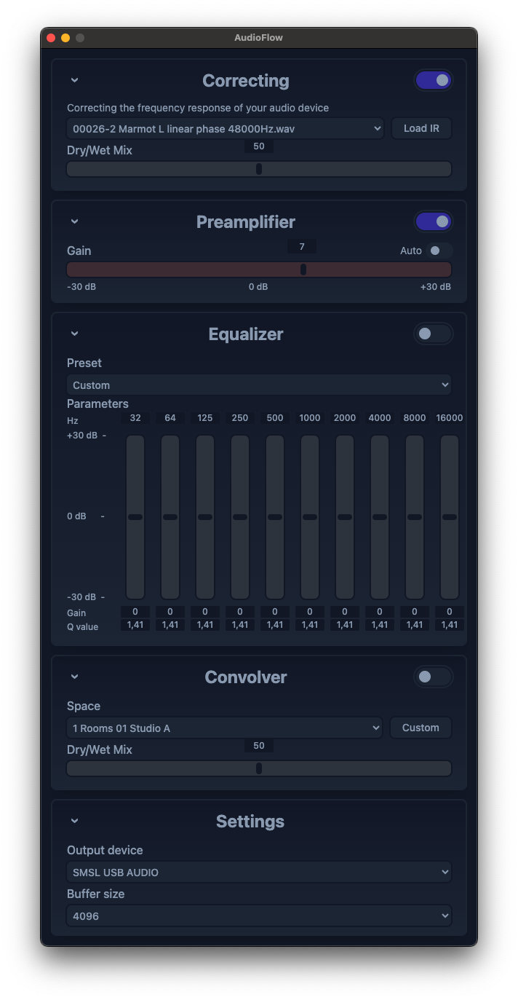

# AudioFlow
AudioFlow is a MacOS system audio equalizer designed to be simple, lightweight, and robust. AudioFlow currently features a 10 band equalizer and a convolution reverb unit. AudioFlow is built in C++ and is powered by Apple's CoreAudio and Accelerate frameworks.

## Demo
https://github.com/user-attachments/assets/401bd529-38a8-45b8-9256-b46ff55a88d3

## Table of Contents
- [Installation Instructions](#installation-instructions)
- [Uninstallation Instructions](#uninstallation-instructions)
- [Usage](#usage)
- [Features](#features)
- [User Interface](#user-interface)
- [Issues](#issues)
- [Contributing](#contributing)
- [Credits](#credits)

## Installation Instructions

### The easy way

Download the latest pkg from the releases page and install it. The package contains all needed dependencies (BlackHole audio driver) and it will install them at once.

Reboot the system. It is required by BlackHole driver.

### The easy way 2

Run `brew install --cask drmoriarty/audioflow/audioflow`
It also installs `blackhole-2ch` as a dependency.

Reboot the system. It is required by BlackHole driver.

### Not very easy way

Download or clone this repository. Ensure that CMake is installed in your system. Run `build.sh` script from the repository folder. It should build the application and you will be able to run it at `ui/out/AudioFlow-darwin-<your arch>` folder.

I assume that you know what you do and it is not needed to speak about dependencies and so on.

## Uninstallation Instructions

Remove `AudioFlow.app` from your `/Application` directory as usual. Remove `BlackHole.driver` from `/Library/Audio/Plug-Ins/HAL/` if you dont need it. 

Use `brew uninstall audioflow` if you used brew for installation.

## Usage
To use AudioFlow, simply open the application and AudioFlow will automatically switch to the ```AudioFlow 2ch``` audio device and route the processed audio to the last selected audio device.

## Features
* Convolution based frequency correction module
  * Adjustable mixing (dry/wet)

* Preamplifier
  * Auto preamplification
  * +-30 dB
    
* Equalizer
  * 10 Bands
  * Simple presets
  * Adjustable gain, frequency, and quality factor (Q)

* Reverb unit
  * Convolution based
  * 135 impulse responses representing different audiospatial environments to choose from
  * Adjustable mixing (dry/wet)

## User Interface


## Issues
Audioflow is currently incompatible with bluetooth audio devices.

## Contributing
All contributions are welcome. Whether you're fixing a bug, adding a new feature, or have an issue, feel free to open a pull request/issue/etc.

## Credits
This project uses the BlackHole Audio Loopback Driver by @ExistentialAudio to capture system audio. https://github.com/ExistentialAudio/BlackHole
